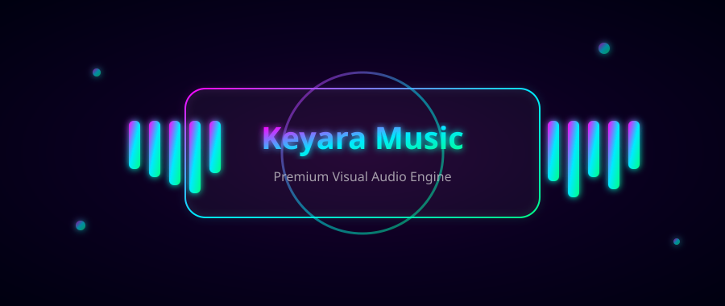

<p align="center">
  
</p>

<h1 align="center">Keyara Music</h1>

<p align="center">
  A maintained Keyara-branded Telegram music bot with hardened playback,
  safer administration tools, and a clean deployment flow.
</p>

> Keyara Music is an independent rebrand and maintained derivative of the
> original project. Original copyright notices, license terms, and required
> attribution are preserved in this repository.

<div align="center">
  
</div>

---

<div align="center">

## ⚡ 𝐍𝐨𝐰 𝐑𝐮𝐧𝐧𝐢𝐧𝐠 𝐨𝐧 𝐀𝐏𝐈 - 𝟏𝟎𝐱 𝐅𝐚𝐬𝐭𝐞𝐫! ⚡

> **𝐑𝐞𝐬𝐩𝐨𝐧𝐬𝐞 𝐓𝐢𝐦𝐞:** `1-3 seconds` | **𝐒𝐭𝐚𝐛𝐢𝐥𝐢𝐭𝐲:** `99.9% Uptime`

[](https://t.me/TrueNakshu)
[](https://github.com/VIP-saksham)
[](https://www.linkedin.com/in/SakshamSwaroop)

[](https://github.com/VIP-saksham/KeyaraMusic/fork)
[](https://github.com/VIP-saksham/KeyaraMusic/stargazers)
[](https://github.com/VIP-saksham/KeyaraMusic/graphs/contributors)

</div>

---

## 🔥 𝐖𝐡𝐚𝐭'𝐬 𝐍𝐞𝐰 𝐢𝐧 𝐭𝐡𝐢𝐬 𝐅𝐨𝐫𝐤

<div align="center">

| ⚡ 𝐅𝐞𝐚𝐭𝐮𝐫𝐞 | 𝐃𝐞𝐬𝐜𝐫𝐢𝐩𝐭𝐢𝐨𝐧 |
|:---:|:---:|
| **🚀 𝐇𝐞𝐥𝐥𝐀𝐏𝐈 𝐄𝐧𝐠𝐢𝐧𝐞** | Direct stream URLs — **no download wait**, song starts in VC in ~1-2 seconds |
| **🤖 𝐒𝐞𝐥𝐟-𝐇𝐞𝐚𝐥 𝐀𝐠𝐞𝐧𝐭 (𝐍𝐕𝐈𝐃𝐈𝐀 𝐍𝐈𝐌)** | Watches logs live, explains any traceback (root-cause + fix) to the log group |
| **⏰ 𝟏𝟐𝐡 𝐀𝐮𝐭𝐨-𝐑𝐞𝐬𝐭𝐚𝐫𝐭** | Graceful scheduled restart via cron — keeps the bot fresh 24/7 |
| **🍪 𝐘𝐨𝐮𝐓𝐮𝐛𝐞 𝐂𝐨𝐨𝐤𝐢𝐞𝐬** | Login-cookie extraction — no IP blocks, 2-5x faster metadata |
| **🔍 𝐒𝐦𝐚𝐫𝐭 𝐒𝐞𝐚𝐫𝐜𝐡** | `/play <song name>` with instant API-backed search fallback |
| **🎨 𝐏𝐫𝐞𝐦𝐢𝐮𝐦 𝐔𝐈** | Animated button icons, glassmorphic thumbnails, blue/red button styling |

</div>

---

## 🚀 𝐐𝐮𝐢𝐜𝐤 𝐃𝐞𝐩𝐥𝐨𝐲

<div align="center">

| **𝐏𝐥𝐚𝐭𝐟𝐨𝐫𝐦** | **𝐃𝐞𝐩𝐥𝐨𝐲 𝐍𝐨𝐰** | **𝐈𝐧𝐟𝐨** |
|:---:|:---:|:---:|
| **𝐇𝐞𝐫𝐨𝐤𝐮** | [](https://dashboard.heroku.com/new?template=https://github.com/VIP-saksham/KeyaraMusic) | 𝐎𝐧𝐞-𝐂𝐥𝐢𝐜𝐤 𝐃𝐞𝐩𝐥𝐨𝐲 |
| **𝐑𝐞𝐧𝐝𝐞𝐫** | [](https://render.com/deploy?repo=https://github.com/VIP-saksham/KeyaraMusic) | 𝟏𝟎𝟎% 𝐅𝐫𝐞𝐞 |
| **𝐕𝐏𝐒** | 𝐒𝐞𝐞 𝐠𝐮𝐢𝐝𝐞 𝐛𝐞𝐥𝐨𝐰 | 𝐅𝐮𝐥𝐥 𝐂𝐨𝐧𝐭𝐫𝐨𝐥 |

</div>

---

## ✨ 𝐅𝐞𝐚𝐭𝐮𝐫𝐞𝐬

<div align="center">

| 🎵 𝐇𝐢𝐠𝐡 𝐐𝐮𝐚𝐥𝐢𝐭𝐲 | 🔗 𝐌𝐮𝐥𝐭𝐢𝐩𝐥𝐞 𝐒𝐨𝐮𝐫𝐜𝐞𝐬 | 📋 𝐏𝐥𝐚𝐲𝐥𝐢𝐬𝐭𝐬 | 🌐 𝐌𝐮𝐥𝐭𝐢-𝐋𝐚𝐧𝐠𝐮𝐚𝐠𝐞 |
|:---:|:---:|:---:|:---:|
| Crystal clear audio | YouTube • Spotify | Create & Manage | Multiple Languages |
| **🎨 𝐄𝐥𝐞𝐠𝐚𝐧𝐭 𝐔𝐈** | **👑 𝐀𝐝𝐦𝐢𝐧 𝐂𝐨𝐧𝐭𝐫𝐨𝐥𝐬** | **⚡ 𝐋𝐢𝐠𝐡𝐭𝐧𝐢𝐧𝐠 𝐅𝐚𝐬𝐭** | **🔊 𝐒𝐭𝐚𝐛𝐥𝐞** |
| Modern Interface | Powerful Commands | 1-3s Response | 99.9% Uptime |

</div>

---

## 🎯 𝐂𝐨𝐦𝐦𝐚𝐧𝐝𝐬

<div align="center">

| 𝐂𝐨𝐦𝐦𝐚𝐧𝐝 | 𝐃𝐞𝐬𝐜𝐫𝐢𝐩𝐭𝐢𝐨𝐧 |
|:---:|:---:|
| `/play [song]` | 🎵 𝐏𝐥𝐚𝐲 𝐦𝐮𝐬𝐢𝐜 |
| `/pause` | ⏸️ 𝐏𝐚𝐮𝐬𝐞 𝐩𝐥𝐚𝐲𝐛𝐚𝐜𝐤 |
| `/resume` | ▶️ 𝐑𝐞𝐬𝐮𝐦𝐞 𝐩𝐥𝐚𝐲𝐛𝐚𝐜𝐤 |
| `/skip` | ⏭️ 𝐒𝐤𝐢𝐩 𝐭𝐫𝐚𝐜𝐤 |
| `/stop` | ⏹️ 𝐒𝐭𝐨𝐩 𝐩𝐥𝐚𝐲𝐛𝐚𝐜𝐤 |
| `/playlist` | 📋 𝐕𝐢𝐞𝐰 𝐩𝐥𝐚𝐲𝐥𝐢𝐬𝐭 |
| `/song [name]` | 📥 𝐃𝐨𝐰𝐧𝐥𝐨𝐚𝐝 𝐚𝐮𝐝𝐢𝐨 |
| `/settings` | ⚙️ 𝐁𝐨𝐭 𝐬𝐞𝐭𝐭𝐢𝐧𝐠𝐬 |

</div>

---

## 🚀 𝐃𝐞𝐩𝐥𝐨𝐲𝐦𝐞𝐧𝐭 𝐆𝐮𝐢𝐝𝐞

<details>
<summary><b>📦 𝐕𝐏𝐒 𝐃𝐞𝐩𝐥𝐨𝐲𝐦𝐞𝐧𝐭 (𝐂𝐥𝐢𝐜𝐤 𝐭𝐨 𝐄𝐱𝐩𝐚𝐧𝐝)</b></summary>

<br>

### **𝐒𝐭𝐞𝐩 𝟏: 𝐔𝐩𝐝𝐚𝐭𝐞 𝐒𝐲𝐬𝐭𝐞𝐦**

```bash
sudo apt-get update && sudo apt-get upgrade -y
```

---

### **𝐒𝐭𝐞𝐩 𝟐: 𝐈𝐧𝐬𝐭𝐚𝐥𝐥 𝐑𝐞𝐪𝐮𝐢𝐫𝐞𝐝 𝐏𝐚𝐜𝐤𝐚𝐠𝐞𝐬**

```bash
sudo apt-get install python3 python3-pip ffmpeg git screen curl -y
```

---

### **𝐒𝐭𝐞𝐩 𝟑: 𝐈𝐧𝐬𝐭𝐚𝐥𝐥 𝐍𝐨𝐝𝐞.𝐣𝐬**

```bash
curl -fsSL https://deb.nodesource.com/setup_lts.x | sudo -E bash -
```

```bash
sudo apt-get install -y nodejs
```

---

### **𝐒𝐭𝐞𝐩 𝟒: 𝐂𝐥𝐨𝐧𝐞 𝐑𝐞𝐩𝐨𝐬𝐢𝐭𝐨𝐫𝐲**

```bash
git clone https://github.com/VIP-saksham/KeyaraMusic
```

```bash
cd KeyaraMusic
```

---

### **𝐒𝐭𝐞𝐩 𝟓: 𝐂𝐫𝐞𝐚𝐭𝐞 𝐓𝐌𝐮𝐱 𝐒𝐞𝐬𝐬𝐢𝐨𝐧**

```bash
tmux new -s keyara
```

**𝐍𝐨𝐭𝐞:** Press `Ctrl+B` then `D` to detach tmux

**𝐓𝐨 𝐑𝐞𝐚𝐭𝐭𝐚𝐜𝐡:**
```bash
tmux ls
```
```bash
tmux attach -t keyara
```

---

### **𝐒𝐭𝐞𝐩 𝟔: 𝐈𝐧𝐬𝐭𝐚𝐥𝐥 𝐕𝐢𝐫𝐭𝐮𝐚𝐥 𝐄𝐧𝐯𝐢𝐫𝐨𝐧𝐦𝐞𝐧𝐭 𝐏𝐚𝐜𝐤𝐚𝐠𝐞**

```bash
sudo apt-get install python3-venv -y
```

---

### **𝐒𝐭𝐞𝐩 𝟕: 𝐂𝐫𝐞𝐚𝐭𝐞 𝐕𝐢𝐫𝐭𝐮𝐚𝐥 𝐄𝐧𝐯𝐢𝐫𝐨𝐧𝐦𝐞𝐧𝐭**

```bash
python3 -m venv venv
```

```bash
source venv/bin/activate
```

---

### **𝐒𝐭𝐞𝐩 𝟖: 𝐈𝐧𝐬𝐭𝐚𝐥𝐥 𝐏𝐲𝐭𝐡𝐨𝐧 𝐃𝐞𝐩𝐞𝐧𝐝𝐞𝐧𝐜𝐢𝐞𝐬**

```bash
pip3 install -U pip
```

```bash
pip3 install -U -r requirements.txt
```

---

### **𝐒𝐭𝐞𝐩 𝟗: 𝐂𝐨𝐧𝐟𝐢𝐠𝐮𝐫𝐚𝐭𝐢𝐨𝐧**

```bash
nano .env
```

**𝐅𝐢𝐥𝐥 𝐢𝐧 𝐲𝐨𝐮𝐫 𝐯𝐚𝐫𝐢𝐚𝐛𝐥𝐞𝐬:**

- `API_ID` & `API_HASH` - Get from [my.telegram.org](https://my.telegram.org)
- `BOT_TOKEN` - Get from [@BotFather](https://t.me/BotFather)
- `MONGO_DB_URI` - MongoDB Atlas connection string
- `OWNER_ID` - Your Telegram user ID
- `OWNER_USERNAME` - Your Telegram username (owner button on /start)
- `STRING_SESSION` - Generate using [@Sessionbbbot](https://t.me/Sessionbbbot)
- `LOG_GROUP_ID` - Log group/channel ID (starting with -100)
- `HELLAPI_URL` & `HELLAPI_KEY` - [HellAPI](https://t.me/HellApiBot) streaming engine (10x speed)
- `NVIDIA_API_KEY` - *(optional)* Free key from [build.nvidia.com](https://build.nvidia.com) — enables the 🤖 Self-Heal Agent
- `SUPPORT_GROUP` - Your support group link
- `SUPPORT_CHANNEL` - Your support channel link

**Save:** `Ctrl+X` then `Y` then `Enter`

---

### **𝐒𝐭𝐞𝐩 𝟏𝟎: 𝐒𝐭𝐚𝐫𝐭 𝐁𝐨𝐭**

**𝐌𝐞𝐭𝐡𝐨𝐝 𝟏:**
```bash
python3 -m KeyaraMusic
```

**𝐌𝐞𝐭𝐡𝐨𝐝 𝟐:**
```bash
bash start
```

**𝐃𝐞𝐭𝐚𝐜𝐡 𝐓𝐦𝐮𝐱:** `Ctrl+B` then `D`

---

### **𝐁𝐨𝐧𝐮𝐬: 𝟏𝟐𝐡 𝐀𝐮𝐭𝐨-𝐑𝐞𝐬𝐭𝐚𝐫𝐭 (𝐂𝐫𝐨𝐧)**

```bash
crontab -e
```

```bash
0 */12 * * * /path/to/keyara_restart.sh >> /path/to/restart_cron.log 2>&1
```

</details>

---

<details>
<summary><b>☁️ 𝐇𝐞𝐫𝐨𝐤𝐮 𝐃𝐞𝐩𝐥𝐨𝐲𝐦𝐞𝐧𝐭 (𝐂𝐥𝐢𝐜𝐤 𝐭𝐨 𝐄𝐱𝐩𝐚𝐧𝐝)</b></summary>

<br>

<div align="center">

[](https://dashboard.heroku.com/new?template=https://github.com/VIP-saksham/KeyaraMusic)

</div>

### **𝐒𝐭𝐞𝐩𝐬:**

1. Click the "Deploy To Heroku" button above
2. Fill in the required environment variables:
   - `API_ID` & `API_HASH` from [my.telegram.org](https://my.telegram.org)
   - `BOT_TOKEN` from [@BotFather](https://t.me/BotFather)
   - `MONGO_DB_URI` - MongoDB connection string
   - `STRING_SESSION` from [@Sessionbbbot](https://t.me/Sessionbbbot)
   - Other required variables
3. Click "Deploy App"
4. Go to Resources tab and enable the worker

</details>

---

<details>
<summary><b>🔄 𝐒𝐞𝐬𝐬𝐢𝐨𝐧 𝐒𝐭𝐫𝐢𝐧𝐠 𝐆𝐞𝐧𝐞𝐫𝐚𝐭𝐨𝐫 (𝐂𝐥𝐢𝐜𝐤 𝐭𝐨 𝐄𝐱𝐩𝐚𝐧𝐝)</b></summary>

<br>

<div align="center">

[](https://t.me/Sessionbbbot)

</div>

### **𝐒𝐭𝐞𝐩𝐬:**

1. 🤖 Start [@Sessionbbbot](https://t.me/Sessionbbbot)
2. 📱 Send your phone number with country code
3. 🔢 Enter the OTP you receive
4. ✅ Copy your session string

</details>

---

<details>
<summary><b>🤔 𝐂𝐨𝐦𝐦𝐨𝐧 𝐈𝐬𝐬𝐮𝐞𝐬 (𝐂𝐥𝐢𝐜𝐤 𝐭𝐨 𝐄𝐱𝐩𝐚𝐧𝐝)</b></summary>

<br>

| **𝐈𝐬𝐬𝐮𝐞** | **𝐒𝐨𝐥𝐮𝐭𝐢𝐨𝐧** |
|:---:|:---:|
| Bot not responding | Check if bot is running with proper permissions |
| No sound in VC | Ensure FFmpeg is properly installed |
| Can't join voice chat | Make bot admin with VC permissions |
| API issues | Double check `API_ID` and `API_HASH` |
| Slow response | Check internet connection and server resources |

</details>

---

## 📊 𝐒𝐭𝐚𝐭𝐬

<div align="center">


</div>

---

## 🌟 𝐂𝐫𝐞𝐝𝐢𝐭𝐬

<div align="center">

**𝐎𝐰𝐧𝐞𝐫 & 𝐌𝐚𝐢𝐧𝐭𝐚𝐢𝐧𝐞𝐫**

[](https://github.com/VIP-saksham)
[](https://t.me/TrueNakshu)
[](https://www.linkedin.com/in/SakshamSwaroop)

**𝐎𝐫𝐢𝐠𝐢𝐧𝐚𝐥 𝐃𝐞𝐯𝐞𝐥𝐨𝐩𝐞𝐫**

[](https://github.com/NoxxOP)

**𝐒𝐩𝐞𝐜𝐢𝐚𝐥 𝐓𝐡𝐚𝐧𝐤𝐬 𝐭𝐨 𝐀𝐥𝐥 𝐂𝐨𝐧𝐭𝐫𝐢𝐛𝐮𝐭𝐨𝐫𝐬**

</div>

---

## 📝 𝐋𝐢𝐜𝐞𝐧𝐬𝐞

<div align="center">

[](LICENSE)

</div>

---

## 💬 𝐂𝐨𝐧𝐭𝐚𝐜𝐭 𝐎𝐰𝐧𝐞𝐫

<div align="center">

| **𝐓𝐞𝐥𝐞𝐠𝐫𝐚𝐦** | **𝐆𝐢𝐭𝐇𝐮𝐛** | **𝐋𝐢𝐧𝐤𝐞𝐝𝐈𝐧** |
|:---:|:---:|:---:|
| [](https://t.me/TrueNakshu) | [](https://github.com/VIP-saksham) | [](https://www.linkedin.com/in/SakshamSwaroop) |
| Fastest Reply | Code & Issues | Professional Profile |

---


---

<p align="center">
  
</p>

</div>
